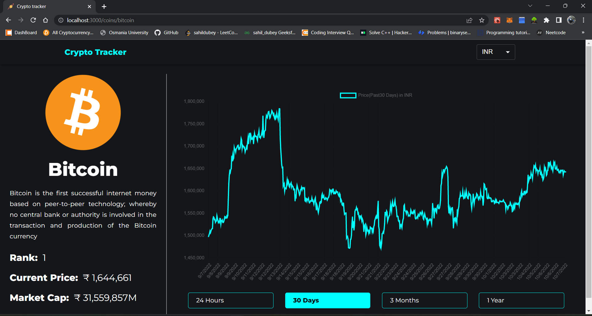

# Crypto Tracker

- This is a mobile responsive web application project made to help user to check the prices of crypto currencies.

- This project uses Cryptocurrency API for real time track of crypto price.
## Built with

- React JS

- Material UI

- Chart JS


## Run Locally

Clone the project

```bash
  git clone https://github.com/sahildubeydev/crypto-tracker
```

Go to the project directory

```bash
  cd crypto-tracker
```

Install dependencies

```bash
  npm install
```

Start the app

```bash
  npm start
```

## Features
- Switch currency
- Search Cryptocurrency
- 1 Day, month, year chart

## Screenshots
- Home Page


- Search Cryptocurrency


- Cointable 


- Switch Country currency


- Navigation


- Coin chart



## More Functionalities

This application still has many functionalities 
that has not been implemented yet custom user profile, wishlist etc.
## Author

- [@sahildubey](https://github.com/sahildubeydev)

